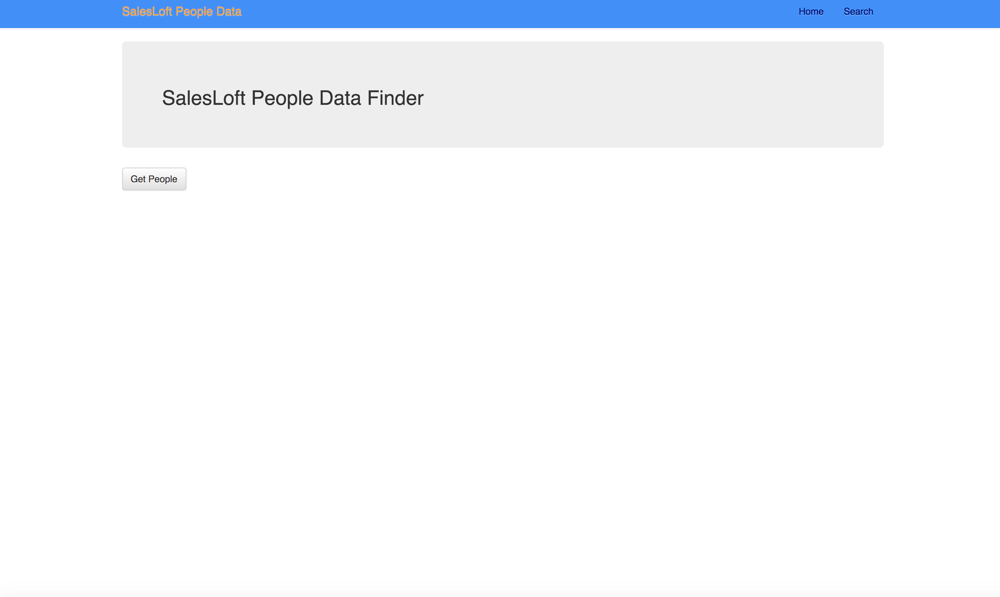
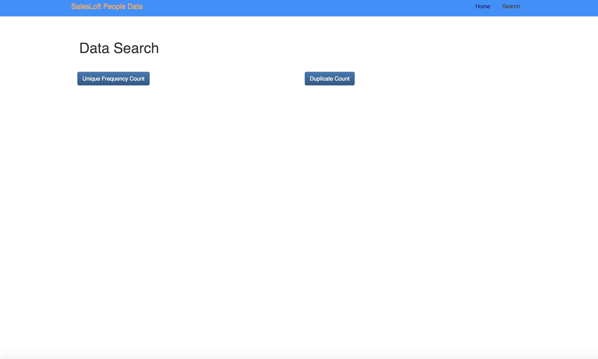

# Overview

## SalesLoft Challenge 
This application will deliver people data listing from the SalesLoft API. Moreover, this application will count the occurrences of unique character in a user's email, and determine if an email may have the possibility to be duplicate.

## Tech Stack Used
*React
*Node.js
*JavaScript
*Axios
*React-Bootstrap
*React-Router-Dom
*String-Similarity npm package

## Future Additions
More styling would have been practical for this app. Although, functionality was the highest priority when putting this application together at this time.

